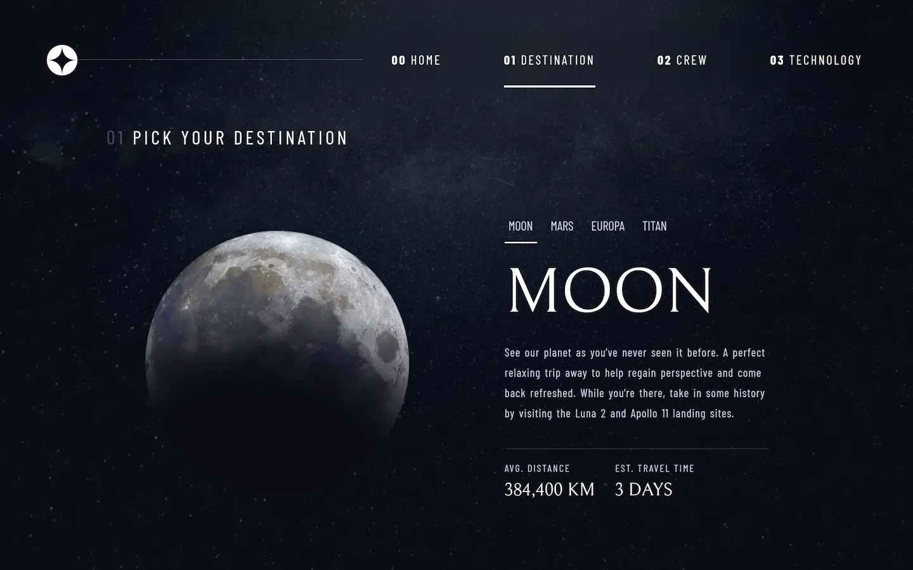

<div id="top"></div>

<div align="center">

<a href="mailto:cosmohydra17@gmail.com"></img></a>
<a href="https://www.instagram.com/cosmo_art0/"></a>
<a href="https://www.discord.com/users/734087835472232559/"></a>
<a href="https://twitter.com/CosmoArt0"></a>

# Space tourism website

This is a solution to the [Space tourism website challenge on Frontend Mentor](https://www.frontendmentor.io/challenges/space-tourism-multipage-website-gRWj1URZ3).

[Solution][solution-url] . [Live Page][live-page]

</div>

<details>
<summary>Table of contents</summary>

-   [Overview](#overview)
    -   [The challenge](#the-challenge)
    -   [Screenshots](#screenshots)
    -   [Links](#links)
-   [My process](#my-process)
    -   [Built with](#built-with)
    -   [What I learned](#what-i-learned)
    -   [Useful resources](#useful-resources)
-   [Author](#author)
-   [Acknowledgments](#acknowledgments)

</details>

## Overview

### The challenge

Users should be able to:

-   View the optimal layout for each of the website's pages depending on their device's screen size
-   See hover states for all interactive elements on the page
-   View each page and be able to toggle between the tabs to see new information

### Screenshots

<table>
        <tr>
		    <td>
                
            </td>
			<td>
                
            </td>
            <td>
                
            </td>
        </tr>
        <tr>
		    <td>
                
            </td>
			<td>
                
            </td>
            <td>
                
            </td>
        </tr>
        <tr>
		    <td>
                
            </td>
			<td>
                
            </td>
            <td>
                
            </td>
        </tr>
        <tr>
		    <td>
                
            </td>
			<td>
                
            </td>
            <td>
                
            </td>
        </tr>
</table>

### Links

-   [Solution][solution-url]
-   [Live Page][live-page]

## My process

### Built with

-   mobile-first workflow
-   Semantic HTML5 markup
-   [React](https://reactjs.org/) - JS library
-   [Nextjs](https://nextjs.org)

<p align="right">(<a href="#top">back to top</a>)</p>

### What I learned

This challenge was a great learning opportunity, it was also very useful to reinforce previous knowledge, and face problems that had not been presented to me before.

To see how you can add code snippets, see below:

```js
const proudOfThisFunc = () => {
	console.log("🎉");
};
```

<p align="right">(<a href="#top">back to top</a>)</p>

### Useful resources

-   [Example resource 1](https://www.example.com) - This helped me for XYZ reason. I really liked this pattern and will use it going forward.
-   [Example resource 2](https://www.example.com) - This is an amazing article which helped me finally understand XYZ. I'd recommend it to anyone still learning this concept.

<p align="right">(<a href="#top">back to top</a>)</p>

## Author

-   Instagram - [@cosmo_art0](https://www.instagram.com/cosmo_art0/)
-   Frontend Mentor - [@CosmoArt](https://www.frontendmentor.io/profile/cosmoart)
-   Twitter - [@CosmoArt0](https://twitter.com/cosmoart0)
-   My personal page - [https://cosmoart.github.io](https://cosmoart.github.io)

<p align="right">(<a href="#top">back to top</a>)</p>

## Acknowledgments

<!-- Crédito a otras personas con quien trabaje o me inspire -->

<p align="right">(<a href="#top">back to top</a>)</p>

[live-page]: https://img.shields.io/github/contributors/othneildrew/Best-README-Template.svg?style=for-the-badge
[solution-url]: https://github.com/othneildrew/Best-README-Template/graphs/contributors
